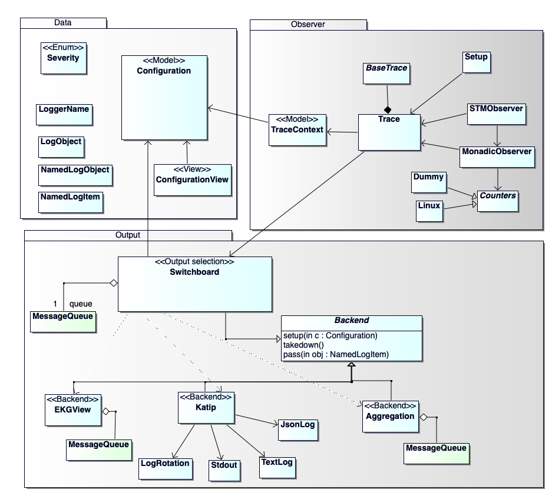

# iohk-monitoring-framework

This framework provides logging, benchmarking and monitoring.

## overview

## documentation

Documentation of the [source code](docs/IOHK-Monitoring-code.pdf) and 
[tests](docs/IOHK-Monitoring-tests.pdf) are available in PDF format.

## building

`cabal new-build`

`cabal new-test`

## development

`ghcid -c "cabal new-repl"` watches for file changes and recompiles them immediately
