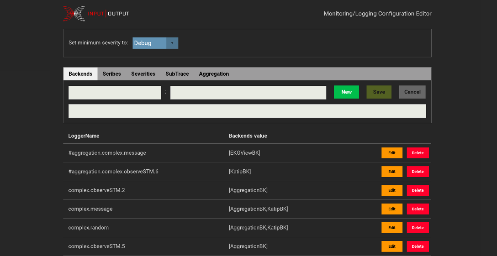

# iohk-monitoring-framework

This framework provides logging, benchmarking and monitoring.

## documentation

Documentation of the [source code and tests](https://github.com/input-output-hk/iohk-monitoring-framework/wiki/IOHK-Monitoring.pdf) in PDF format. Please, download the PDF file and open it in an external viewer. It contains links for easier navigation in the source code. Those links are not active in the online viewer.

Slides of our presentations are available in [html](https://input-output-hk.github.io/iohk-monitoring-framework/) format.

And, introductory one-pagers on logging and benchmarking are available in [pdf](https://input-output-hk.github.io/iohk-monitoring-framework/) format.

## module dependencies

## building and testing

`cabal new-build all`

`cabal new-test all`

## examples
Some examples are available in the directory [examples](https://github.com/input-output-hk/iohk-monitoring-framework/tree/master/iohk-monitoring/examples):
* `simple`  -  run with `cabal new-run example-simple`
* `complex`  -  run with `cabal new-run example-complex`

These showcase the usage of this framework in an application. The *complex* example includes `EKGView` (http://localhost:12789) and the configuration editor (http://localhost:13789).

## development

* `cabal new-build all` and `cabal new-test all`
* `ghcid -c "cabal new-repl"` watches for file changes and recompiles them immediately

To Done
