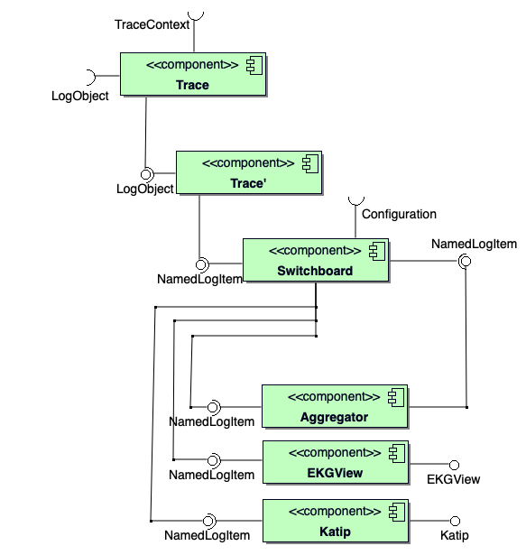
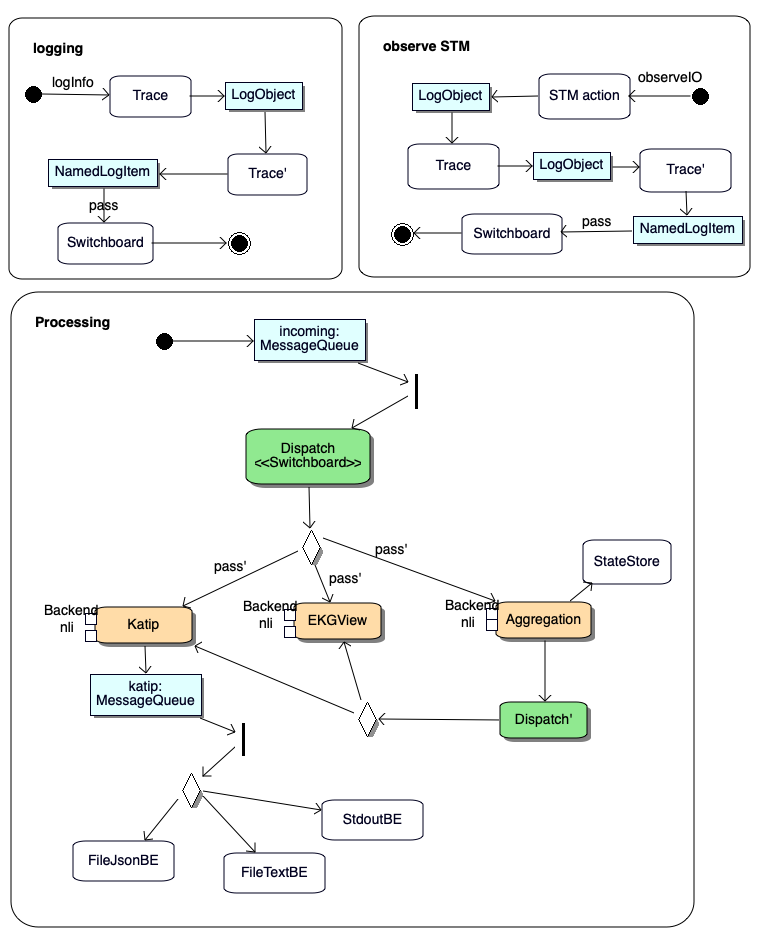
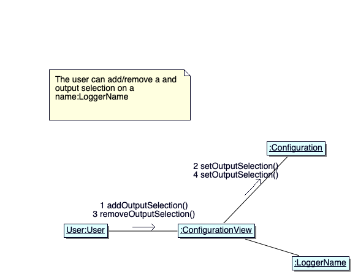
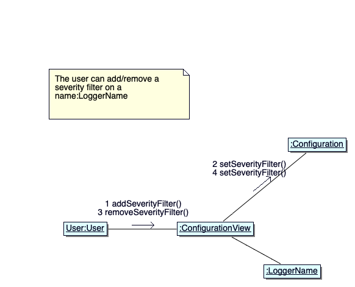
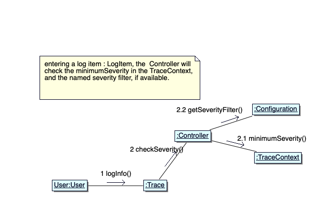
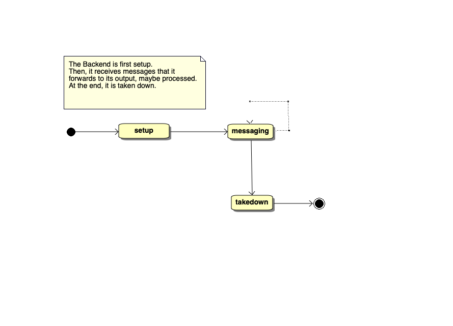

# Documentation

In this directory, enter a `nix-shell` to have access to the required tools
to generate documentation.

# Presentations

## Presentation 2018-12-04

This was the first presentation of `iohk-monitoring-framework`:

[Presentation 2018-12-04](/iohk-monitoring-framework/pres-20181204/html/index.html)

# Haddock documentation

`Haddock` automatically generates documentation from source code:

[package contra-tracer](/iohk-monitoring-framework/haddock/contra-tracer/index.html)

## UML Diagrams

Diagrams have been edited with [BOUML](https://bouml.fr), a light-weight and fast UML editor.
License: "free of use", no license.

## Overview modules

## Components

## Activity

## STM observer

## Configuration

### configure output selection

### configure severity filter

### apply severity filter

## Setup procedure

## Backend state machine

## Integration in Cardano.Shell

